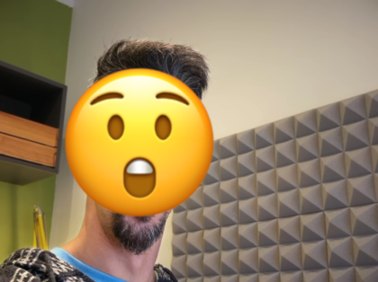

# 😶‍🌫️ Emotion Detection (in the browser)

This is a small, hands-on project to learn what it _actually_ takes to serve ML models **IN REAL TIME** directly **in the browser**.

The setup is simple on purpose:

- a custom **emotion classification model** trained on FER / [FER+](https://github.com/microsoft/FERPlus?tab=readme-ov-file),
- a **pre-trained face detection model** to crop faces from webcam input,
- everything exported to **ONNX** and run client-side with JavaScript.

No servers. No APIs. Just models, a browser, and a webcam.

There’s a public demo running the latest version here:
👉 [https://www.tonipenya.com/-learn-emotion_detection/](https://www.tonipenya.com/-learn-emotion_detection/)



## What’s in here

- A lightweight CNN for emotion classification (trained in PyTorch).
- Support for **soft labels** (FER+ vote distributions).
- Face detection using a pre-trained ONNX model (UltraFace).
- An end-to-end **browser inference pipeline** (camera → face → emotion).
- A reproducible ML pipeline orchestrated with **DVC**.
- Zero backend. Everything runs locally or in the browser.

This repo is intentionally practical and focused on learning by building.

## Run the full pipeline

Everything can be reproduced end-to-end with DVC.

```sh
pip install -r requirements.txt
dvc repro
```

This will:

- prepare the data,
- train the emotion model,
- export artifacts (TorchScript + ONNX),
- and produce the files used by the browser demo.

No Docker for this repo.

## Why this exists

I wanted to explore:

- what breaks (and why) when exporting real PyTorch models to ONNX,
- how much preprocessing logic you really want inside the model,
- and how far you can push **client-side ML** without a backend.

This is a learning project, not a product.
Some parts are rough, some are overthought, all of it is intentional.

If you’re curious about ML deployment, browser inference, or just enjoy practical experiments, you might find this interesting.

Built for fun, learning, and tinkering.
Expect experiments, not polish.
